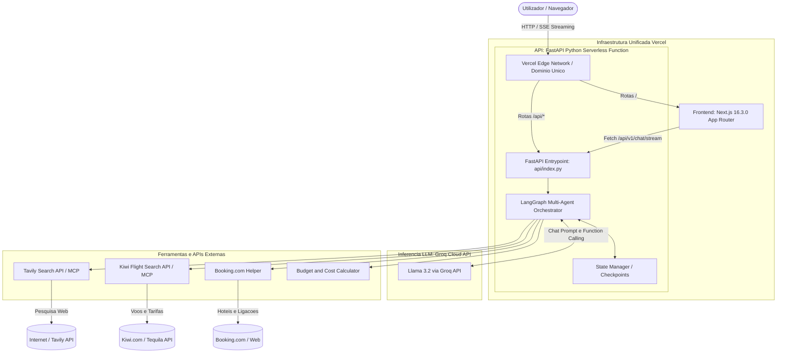
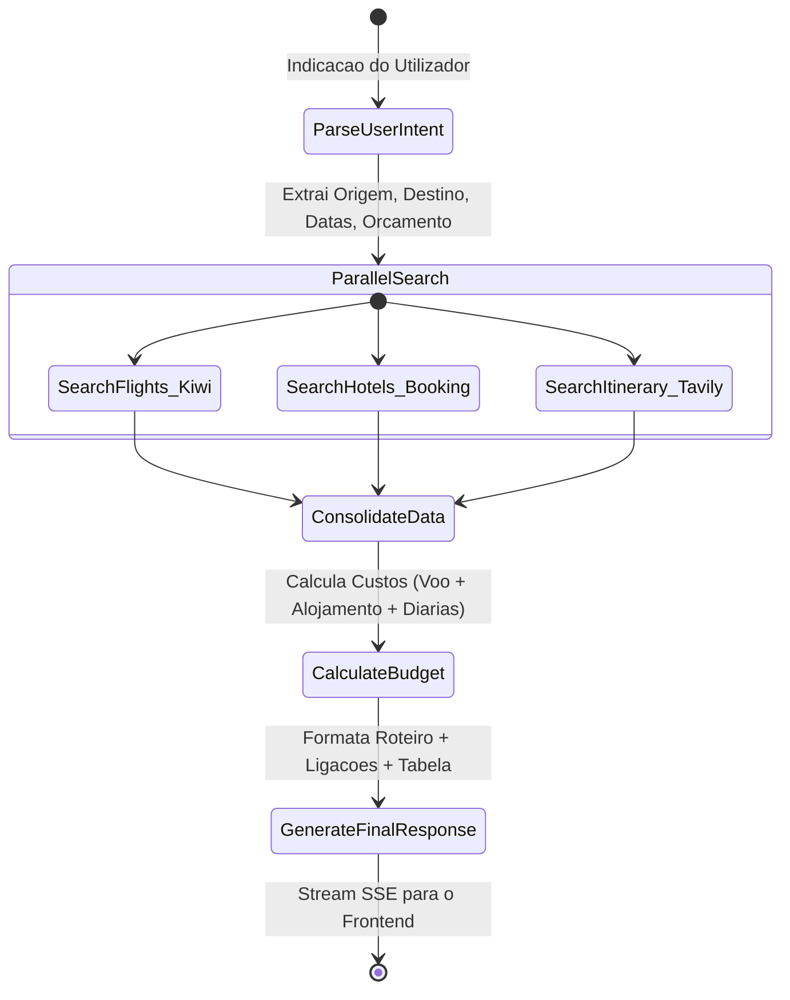

# Arquitetura do Sistema: Tripa AI (Assistente de Viagens e Ferias)

## 1. Visao Geral do Projeto

O Tripa AI e um assistente conversacional inteligente concebido para analisar e planear viagens e ferias economicas com base em indicacoes em linguagem natural fornecidas pelo utilizador.

### Principais Objetivos
1. Compreensao de Intencoes e Restricoes: Extracao de origem, destino, datas ou duracao, estilo de viagem e teto orcamental.
2. Pesquisa de Voos com Kiwi (MCP / Tequila API): Pesquisa de rotas otimizadas pelo melhor preco e conexoes eficientes.
3. Alojamento e Ligacoes do Booking.com: Selecao de hoteis e geracao de ligacoes diretas com parametros pre-preenchidos.
4. Roteiros Turisticos e Gastronomia (Tavily Search): Sugestoes de atividades, gastronomia local e mobilidade urbana.
5. Consolidacao Financeira: Calculo do custo total estimado da viagem (Voos + Alojamento + Alimentacao + Transportes + Margem de seguranca).
6. Resposta em Tempo Real: Streaming SSE (Server-Sent Events) via FastAPI Serverless com inferencia de baixa latencia via Groq (Llama 3.2).
7. Deploy Unificado na Vercel: Tanto a interface Next.js como os endpoints FastAPI correm na infraestrutura Serverless da Vercel.

---

## 2. Diagrama de Arquitetura de Alto Nivel (Deploy Unificado na Vercel)



---

## 3. Stack Tecnologica e Estrategia de Implementacao (Deploy Vercel)

| Camada | Tecnologia | Alojamento / Deploy | Justificacao Tecnica |
| :--- | :--- | :--- | :--- |
| **Frontend** | **Next.js 16.3.0 (React 19, TypeScript, Tailwind CSS)** | **Vercel** | Otimizacao nativa para Next.js, rede Edge global, Server Components e streaming de UI com zero configuracao. |
| **Backend API** | **FastAPI (Python 3.11+)** | **Vercel Serverless Functions (`@vercel/python`)** | Execucao serverless atraves da pasta `api/`, partilha do mesmo dominio (sem necessidade de CORS complexo), custo zero quando inativo e escalabilidade automatica. |
| **Inferencia LLM** | **Llama 3.2 (3B / 11B / 70B)** | **Groq Cloud API** | Velocidade extrema de inferencia (LPU Inference Engine), reduzindo tempos de resposta para milissegundos. |
| **Orquestracao** | **LangGraph / LangChain Core** | Python na Vercel | Execucao deterministica de grafos de decisao e nos de pesquisa paralela. |
| **Pesquisa Web** | **Tavily Search API / MCP** | Tavily Cloud | Resultados de pesquisa web limpos e estruturados para consumo por modelos LLM. |
| **Pesquisa de Voos** | **Kiwi.com (Tequila API / MCP)** | Kiwi Cloud | Melhor cobertura de combinacoes de voos multitrecho e low-cost globais. |

---

## 4. Arquitetura do Grafo de Agentes (LangGraph Workflow)



### Detalhes dos Componentes:

1. **ParseUserIntentNode**:
   - Processa o pedido com o Llama 3.2 na Groq para identificar entidades essenciais (origem, destino, datas, viajantes, orcamento).
2. **FlightAgentNode (Kiwi)**:
   - Consulta a API da Kiwi para obter as opcoes mais baratas e tempos de viagem.
3. **HotelAgentNode (Booking)**:
   - Identifica zonas recomendadas e gera ligacoes de pesquisa diretas para o Booking.com.
4. **ExperienceAgentNode (Tavily)**:
   - Pesquisa restaurantes tipicos, atracoes imperdiveis e precos medios locais.
5. **BudgetConsolidationNode**:
   - Consolida os custos:
     $$\text{Total Estimado} = \text{Voos} + \text{Alojamento} + (\text{Diaria de Alimentacao} + \text{Transporte} + \text{Atividades}) \times \text{Dias} + \text{Margem (10\%)}$$
6. **StreamFormatterNode**:
   - Emite a resposta via Server-Sent Events (SSE) para o cliente Next.js.

---

## 5. Estrutura de Diretorios Unificada (Otimizada para Vercel)

Uma estrutura monorepo integrada permite que um unico repositorio no GitHub faca o deploy completo na Vercel:

```
tripa/
├── docs/
│   ├── AGENTS.md                  # Diretrizes tecnicas e memoria para agentes
│   ├── system_architecture.md     # Este documento de arquitetura
│   └── api_contracts.md           # Definicao de schemas e eventos SSE
│
├── api/                           # Backend FastAPI (Vercel Serverless Function)
│   ├── index.py                   # Ponto de entrada FastAPI exportando 'app'
│   ├── v1/
│   │   ├── endpoints/
│   │   │   ├── chat.py            # Endpoint de streaming SSE (/api/v1/chat/stream)
│   │   │   └── health.py          # Endpoint de verificacao (/api/v1/health)
│   │   └── router.py
│   ├── core/
│   │   ├── config.py              # Gestao de chaves (GROQ_API_KEY, TAVILY_API_KEY, etc.)
│   │   └── logging.py
│   ├── models/                    # Schemas Pydantic
│   │   ├── chat.py
│   │   ├── travel.py
│   │   └── state.py
│   └── services/
│       ├── agents/                # Orquestracao LangGraph
│       │   └── graph.py
│       └── tools/                 # Conectores de servicos
│           ├── groq_client.py
│           ├── kiwi.py
│           ├── tavily.py
│           └── booking.py
│
├── src/                           # Frontend Next.js 16.3.0 (App Router)
│   ├── app/
│   │   ├── layout.tsx
│   │   ├── page.tsx               # Interface principal de planeamento
│   │   └── globals.css
│   ├── components/
│   │   ├── chat/                  # Interface de chat e streaming
│   │   ├── travel/                # Cartoes de voos, hoteis e orcamento
│   │   └── ui/                    # Componentes base de interface
│   ├── hooks/
│   │   └── useChatStream.ts       # Hook de consumo de eventos SSE
│   ├── types/
│   │   └── travel.ts              # Tipos TypeScript espelhados do Pydantic
│   └── lib/
│       └── utils.ts
│
├── requirements.txt               # Dependencias Python para a Vercel Serverless
├── package.json                   # Dependencias Node.js para Next.js 16.3.0
├── tsconfig.json
├── tailwind.config.ts
├── vercel.json                    # Configuracao de roteamento da Vercel
├── .env.example
└── .gitignore
```

---

## 6. Configuracao do `vercel.json`

O ficheiro `vercel.json` garante o roteamento dos pedidos `/api/*` diretamente para o runtime Python do FastAPI, enquanto as restantes rotas sao processadas pelo Next.js:

```json
{
  "rewrites": [
    {
      "source": "/api/(.*)",
      "destination": "/api/index.py"
    }
  ]
}
```

---

## 7. Roteiro de Implementacao

### Fase 1: Setup Hello World Unificado na Vercel (Estado Atual)
- [x] Documentacao e arquitetura unificada na pasta docs.
- [ ] Criacao do `api/index.py` (FastAPI Hello World com suporte a Groq e SSE).
- [ ] Criacao do `src/` (Next.js 16.3.0 Hello World com interface ligada ao `/api/v1/health` e `/api/v1/chat/stream`).
- [ ] Configuracao do `requirements.txt`, `package.json` e `vercel.json`.

### Fase 2: Integracao de Ferramentas (Tavily e Kiwi)
- [ ] Conector de voos Kiwi.
- [ ] Conector de pesquisa Tavily.
- [ ] Gerador de ligacoes com parametros para o Booking.com.

### Fase 3: Orquestracao com LangGraph e Calculo Orcamental
- [ ] Fluxo de decisao com LangGraph na FastAPI.
- [ ] Consolidacao financeira detalhada.

### Fase 4: Interface Rica e Deploy
- [ ] Cartoes interativos de voos, hoteis e discriminacao de despesas.
- [ ] Validacao de deploy unificado na Vercel.
